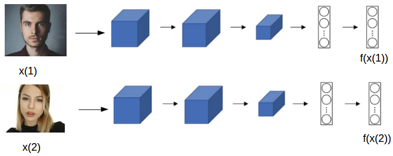
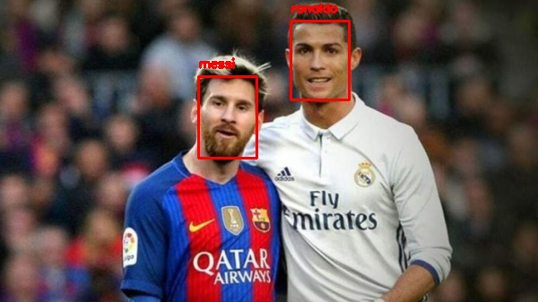

<h1>Objective</h1> 
This is a simple face detction and recognition model using one shot learning algorithm. It uses siamese network to predict the person's face along with its name both in images as well as through live videos.

<h1>Description</h1>
One-shot learning is an object categorization problem, found mostly in computer vision. Whereas most machine learning based object categorization algorithms require training on hundreds or thousands of samples/images and very large datasets, one-shot learning aims to learn information about object categories from one, or only a few, training samples/images.

In this project , I have used two deep learning models namely res10_300x300_ssd_iter_140000.caffemodel which is used to extract a face from the frame and then it is passed on to the pretrained VGG_face model which is used to generate facial embeddings from it. These facial embeddings then comapred with the orignal embeddings using cosine similarity and hence the specific face is recognized.
This project contains three files:
1) main.py
2) recognize.py
3) recognize_video.py

<b>main.py:-</b> The faces are extracted using res10_300x300_ssd_iter_140000.caffemodel and them embeddings are generated for the dataset images using VGG_Face model, then the embeddings along with person's name are stored in the python dictionary and then saved it as a pickle file.

<b>recognize.py:-</b> In this file picke file is loaded such the image which is to be tested is passed on to the two models then the embeddings is generated and comapred with the embeddings from the dictionary using cosine similarity.

<b>recognize_video.py:-</b> In this file picke file is loaded such that the video frames which is to be tested is passed on to the two models then the embeddings is generated for each frame and comapred with the embeddings from the dictionary using cosine similarity and diplays the result on the screen.

<h1>Results:</h1>

This model is predicting the faces from the images as well as through web cam sucessfully .

